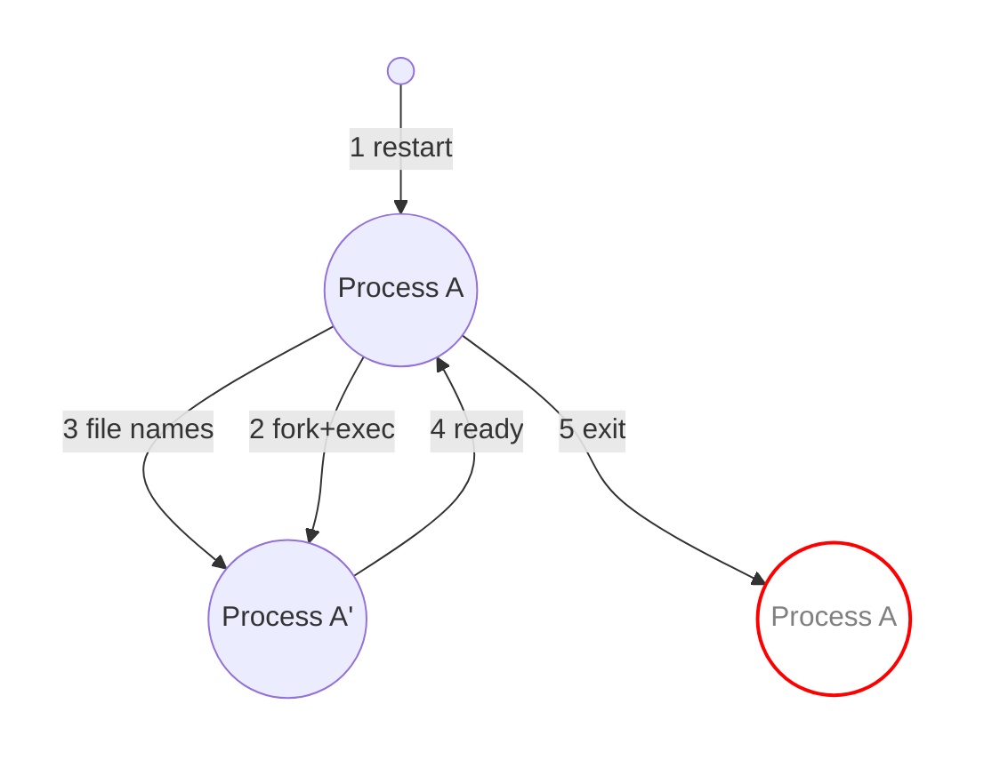

## TL;DR


## 背景
对于一个持续迭代的网络服务, 变更是家常便饭. 常规的变更流程如下:


1. **更新程序/配置**: 当修复了已知bug或者是新增功能时, 需要更新程序. 或者是更改了配置;
2. **停止当前服务**: 为避免和新程序冲突, 需要暂停当前服务;
3. **启动新程序**: 再次启动程序让新程序/配置生效;

这个变更过程存在很大问题: 变更过程会影响正在使用此服务的用户. 很多成熟的的项目都支持优雅重启(`graceful restarting`), 保证重启服务对用户"无感", 如`Nginx`, `SSH server`等都支持reload重启方式, 保证重启过程不影响用户使用.

普通项目尝尝也有`graceful restarting`的需求, `graceful restarting`的原理是什么呢? 要回答这个问题, 我们不妨先想想满足什么条件才能算作`graceful restarting`? 我认为至少要满足一下条件:
1. 升级过程中不影响正在使用此服务的用户;
2. 升级过程中有新的用户接入时, 也能正常提供服务;
3. 服务升级后接入的用户由更新后的程序提供服务;
4. 如果升级失败, 仍然可以提供正常服务;

基于以上条件, 可以想到一个简单的实现方式: 每个需要`graceful restarting`的服务负责把监听的`socket`设置为[SO_REUSEPORT](https://man7.org/linux/man-pages/man7/socket.7.html), 这样就允许多个进程监听同一个地址. 这个方式看起来能做到`graceful restarting`, 但实际上还是存在一些问题的: 多个进程分别创建socket监听同一个地址就会导致每个进程都创建一个`socket`, 这种情况下请求到来时, 该由哪个进程来处理是由操作系统决定的(操作系统负责为多个进程做负载均衡). 所以当新老服务进程同时存在时, 无法保证新到来的请求一定被新的服务进程处理. 

要想解决这个问题, 就要让新老服务进程共享`socket`, 所以自然而然的会想到让老的服务进程`fork`子进程, 并且把自己监听的`socket`继承给子进程. Cloudflare就基于这个原理实现了一个**Go语言**版本的`graceful restarting`库--[tableflip](https://github.com/cloudflare/tableflip). 下面就来分析一下`tableflip`的实现.


## tableflip

### tableflip使用示例

### tableflip实现分析
`tableflip`的实现思路: 当进程收到`graceful restarting`信号时, 父进程准备好要继承给子进程的socket, 然后创建子进程(`fork` + `exec`), 子进程继承了父进程已经监听的`socket`, 当需要监听一个地址时, 先检查是否已经从父进程那里继承了, 如果已经继承了, 就直接拿来用, 如果没有从父进程继承, 则自己创建新的`socket`. 子进程启动后初始化完成通知父进程, 此时父进程就可以退出了.



父进程创建子进程的逻辑在源码的`child.go:startChild()`中, 以下是简化版本(忽略了错误处理逻辑). startChild()做的事情就是为子进程准备文件描述符和环境变量, 然后创建子进程, 并通过管道和子进程通信.
```Go
func startChild(env *env, passedFiles map[fileName]*file) (*child, error) {
	// These pipes are used for communication between parent and child
	// readyW is passed to the child, readyR stays with the parent
    // readyW传递给子进程, 子进程启动且准备就绪后通过写readyW通知父进程
	readyR, readyW, err := os.Pipe() 
	// ...

    // 父进程向namesW写入文件描述符的信息(connKind, network, addr), 
    // 子进程会从namesR读取这些信息, 从而确定从父进程继承过来的文件描述符具体信息
	namesR, namesW, err := os.Pipe()    
	// ...

	// Copy passed fds and append the notification pipe
    // fds是需要继承给子进程的文件描述符, 前五个文件描述分别是:
    // 0~2: stdin, stdout, stderr,
    // 3(readW): 子进程准备就绪时通过此文件描述符通知父进程;
    // 4(nameR): 子进程从此文件描述符中读取文件描述符信息;
    // 5...: 需要子进程继承的文件描述符(一般是监听的socket)
	fds := []*os.File{os.Stdin, os.Stdout, os.Stderr, readyW, namesR}
	var fdNames [][]string
    // 注意: fdNames不包含0~4 5个描述符的信息(父子进程约定好了, 0~4文件描述符的作用是已知的)
	for name, file := range passedFiles {
		nameSlice := make([]string, len(name))
		copy(nameSlice, name[:])
		fdNames = append(fdNames, nameSlice)
		fds = append(fds, file.File)
	}

	// Copy environment and append the notification env vars
    // environ是要传递给子进程的环境变量, 特别添加了sentinelEnvVar环境变量
    // 设置sentinelEnvVar的作用是决定进程如何初始化文件描述符
	sentinel := fmt.Sprintf("%s=yes", sentinelEnvVar)
	var environ []string
	for _, val := range env.environ() {
		if val != sentinel {
			environ = append(environ, val)
		}
	}
	environ = append(environ, sentinel)

    // 这里调用newProc创建子进程, 传入了前面准备好的fds和environ
    // newProc会根据当前的平台(Linux or darwin)决定如何创建子进程
    // 对Linux而言, newProc的底层是fork+exec
	proc, err := env.newProc(os.Args[0], os.Args[1:], fds, environ)
	// ...

	exited := make(chan struct{})
	result := make(chan error, 1)
	ready := make(chan *os.File, 1)

	c := &child{
		env,
		proc,
		readyR,
		namesW,
		ready,
		result,
		exited,
	}

    // 通过pipe把子进程继承的文件描述符信息发送给子进程
	go c.writeNames(fdNames) 

    // 等待子进程结束的信号(正常情况下子进程不应该结束, 如果子进程在父进程之前结束, 说明子进程异常)
	go c.waitExit(result, exited)
    
    // 等待接收子进程发送过来的reay信号
	go c.waitReady(ready)
	return c, nil
}

// 等待子进程发送ready信号
func (c *child) waitReady(ready chan<- *os.File) {
	var b [1]byte
	if n, _ := c.readyR.Read(b[:]); n > 0 && b[0] == notifyReady {
		// We know that writeNames has exited by this point.
		// Closing the FD now signals to the child that the parent
		// has exited.
		ready <- c.namesW
	}
	c.readyR.Close()
}

// 父进程把文件描述符信息通过c.namesW管道传递给子进程
func (c *child) writeNames(names [][]string) {
	enc := gob.NewEncoder(c.namesW)
	if names == nil {
		// Gob panics on nil
		_ = enc.Encode([][]string{})
		return
	}
	_ = enc.Encode(names)
}

```

子进程启动后会检查继承了父进程的哪些文件描述符, 将文件描述符保存下来, 供后续调用`Listen`时查询. 当子进程调用Ready时, 会向父进程发送消息(如果父进程存在).
```Go
func newParent(env *env) (*parent, map[fileName]*file, error) {
    // 父进程在创建子进程时为子进程设置了sentinelEnvVar环境变量, 所以if不成立
	if env.getenv(sentinelEnvVar) == "" {
		return nil, make(map[fileName]*file), nil
	}

    // 根据child.go:startChild()可知:
    // 文件描述符3用于子进程ready后通知父进程
    // 文件描述符4用于子进程读取>=5的文件描述符的信息
	wr := env.newFile(3, "write")
	rd := env.newFile(4, "read")

	var names [][]string
    // 读取父进程传递的文件描述符信息
	dec := gob.NewDecoder(rd)
	if err := dec.Decode(&names); err != nil {
		return nil, nil, fmt.Errorf("can't decode names from parent process: %s", err)
	}

    // 把>=5的文件描述符(fd)和其信息(connKind, network, addr)关联起来
	files := make(map[fileName]*file)
	for i, parts := range names {
		var key fileName
		copy(key[:], parts)

		// Start at 5 to account for stdin, etc. and write
		// and read pipes.
		fd := 5 + i
		env.closeOnExec(fd)
		files[key] = &file{
			env.newFile(uintptr(fd), key.String()),
			uintptr(fd),
		}
	}

	result := make(chan error, 1)
	exited := make(chan struct{})
	go func() {
		defer rd.Close()

		n, err := io.Copy(ioutil.Discard, rd)
		if n != 0 {
			err = errors.New("unexpected data from parent process")
		} else if err != nil {
			err = fmt.Errorf("unexpected error while waiting for parent to exit: %s", err)
		}
		result <- err
		close(exited)
	}()

	return &parent{
		wr:     wr, // 记住, parent.wr用于通知父进程
		result: result,
		exited: exited,
	}, files, nil
}

// 调用Ready时, 如果parent存在, 则会调用sendReady
func (u *Upgrader) Ready() error {
	u.readyOnce.Do(func() {
		u.Fds.closeInherited()
		close(u.readyC)
	})

	if u.opts.PIDFile != "" {
		if err := writePIDFile(u.opts.PIDFile); err != nil {
			return fmt.Errorf("tableflip: can't write PID file: %s", err)
		}
	}

	if u.parent == nil {
		return nil
	}
    // 向父进程发送消息
	return u.parent.sendReady()
}

// 向parent.wr写入消息, 通知父进程
func (ps *parent) sendReady() error {
	defer ps.wr.Close()
	if _, err := ps.wr.Write([]byte{notifyReady}); err != nil {
		return fmt.Errorf("can't notify parent process: %s", err)
	}
	return nil
}
```

说点题外话: `tableflip`的代码不算多, 但是读起来非常绕. 因为这个库的代码同时包含了父进程和子进程的执行逻辑. 父进程的执行流程和子进程的执行流程差别很大, 而且子进程也可能成为父进程, 所以也会执行父进程的逻辑. 此外阅读`tableflip`的源码还要对Linux环境下文件描述符(子进程继承了父进程的文件描述符), 管道(父子进程间使用管道进行通信)等有一些了解. 所以

## 参考
* [Graceful upgrades in Go](https://blog.cloudflare.com/graceful-upgrades-in-go/)
* [GLB part 2: HAProxy zero-downtime, zero-delay reloads with multibinder](https://github.blog/news-insights/the-library/glb-part-2-haproxy-zero-downtime-zero-delay-reloads-with-multibinder/)


Q: 连接器server父子进程共享了日志文件的文件表项吗? 为什么日志给是正常?
A: 因为打开日志文件时设置了O_APPEND, O_APPEND 在多个进程或线程对同一文件描述符写入时，能避免写入冲突。操作系统会确保每次写入都是原子的，即便多个进程或线程同时写入，也不会发生写入位置交错的问题（比如写到相同的位置）。